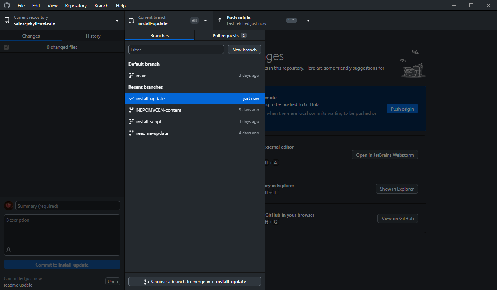

# Safex — strona wizytówka

## Struktura witryny

Witryna składa się z trzech rodzajów stron:

- Strony zwykłe — zawierają zwykłą zawartość taką jak tekst lub obrazki.

  - przykład: _Oferta_, _O nas_, _Kontakt_
  - adres: `strona.pl/[nazwa-strony]`
  - pliki źródłowe: `_pages/[nazwa-strony].md`

- Strony kategorii — zawierają zdjęcie i opis kategorii usług. Stroną nadrzędną
  jest dla nich strona `Oferta`.

  - przykład: _Dla służb_, _Produkty na zamówienie_, _Wyposażenie sceniczne_
  - adres: `strona.pl/oferta/[nazwa-kategorii]`
  - pliki źródłowe: `_categories/[nazwa-kategorii].md`

- Strony usług — zawierają opis i zdjęcia usługi. Stroną nadrzędną jest dla nich
  strona kategorii, w której dana usługa się znajduje.

  - przykład: _Siatki elewacyjne_, _Zbiorniki pożarowe_
  - adres: `strona.pl/oferta/[nazwa-kategorii]/[nazwa-usługi]`
  - pliki źródłowe: `_services/[nazwa-usługi].md`

Podczas edycji pamiętaj o następujących zasadach:

- Nazwy katalogów znajdujących się w katalogu `_services` muszą odpowiadać
  nazwom kategorii w katalogu `_categories`.

- W nazwach plików źródłowych nie stosuj spacji i polskich znaków — zamiast
  nazwy `nasze usługi.md` wybierz raczej `nasze-uslugi.md`.

- Zdjęcia usług i kategorii umieszczaj w katalogu `assets/images_source/oferta`.
  Wykorzystują one podobną zasadę co pliki usług i kategorii:
  - Zdjęcie kategorii:
    - Katalog: `assets/images_source/oferta/[nazwa-kategorii]/`
    - Nazwa pliku: `[nazwa-kategorii].jpg`
    - Format: JPEG
    - Przykład: `assets/images_source/oferta/dla-sluzb/dla-sluzb.jpg`
  - Zdjęcia usług:
    - Katalog: `assets/images_source/oferta/[nazwa-kategorii]/[nazwa-usługi]`
    - Nazwa pliku: `[nazwa-usługi]-[numer-zdjęcia].jpg`
    - Format: JPEG
    - Zdjęcie o numerze 1 zostanie umieszczone na górze strony
    - Każde zdjęcie usługi zostanie umieszczone w galerii na dole strony, w
      kolejności zgodnej z numeracją.
    - Przykład:
      `assets/images_source/oferta/dla-sluzb/zbiorniki-pozarowe/zbiorniki-pozarowe-1.jpg`

## Instalacja i uruchomienie lokalnej kopii

Lokalne środowisko umożliwia natychmiastowy podgląd wprowadzonych zmian.
Instrukcja instalacji:

1. Zainstaluj następujące narzędzia:

   - Git ([https://git-scm.com/downloads](https://git-scm.com/downloads))
   - Node.js ([https://nodejs.org/](https://nodejs.org/))
   - Ruby
     ([https://www.ruby-lang.org/en/documentation/installation/](https://www.ruby-lang.org/en/documentation/installation/))
   - Jekyll oraz Bundler (`gem install jekyll bundler`)

2. Uruchom okno PowerShell w folderze, do którego chcesz sklonować projekt
   (shift + prawy przycisk myszy).
3. Sklonuj repozytorium za pomocą polecenia
   `git clone --recurse-submodule https://github.com/morphy/safex-jekyll-website.git`.
   W katalogu pojawi się folder z projektem.
4. Przejdź do katalogu projektu przy użyciu polecenia `cd safex-jekyll-website`.
5. Uruchom skrypt instalacyjny za pomocą polecenia `npm install`.

Po zainstalowaniu projektu można używać następujących poleceń:

- `npm run dev` - uruchamia lokalny podgląd (dostępny pod adresem
  [http://localhost:4000](http://localhost:4000)).
- `npm run format` - uruchamia narzędzie do automatycznego formatowania plików.

Polecenia wywołuj w oknie PowerShell w **głównym katalogu projektu** (shift +
prawy przycisk myszy).

## Modyfikacja i dodawanie zawartości

1. Edycję strony za każdym razem zacznij od sprawdzenia, czy odpowiedni branch
   jest aktywny.

   

2. Wprowadź zmiany w plikach strony.
3. Sprawdź, które pliki są wybrane do commita. Domyślnie Github Desktop wybiera
   wszystkie zmodyfikowane pliki. Pliki widoczne są na liście po lewej stronie
   okna. W prawej części ekranu widoczny jest tak zwany _diff_ — widok dokładnie
   pokazujący zmiany wprowadzone w plikach.

   

4. W lewym dolnym roku okna, w polu `Summary (required)` wpisz krótki opis zmian
   (np. "zmiana danych kontaktowych").
5. Naciśnij przycisk `Commit to [nazwa-brancha]`.

   

6. Utwórz tyle commitów, ile potrzebujesz. Zmiany warto organizować w mniejsze
   grupy za pomocą commitów, tak aby potem łatwo było zorientować się, co
   zostało kiedy dodane.
7. Naciśnij przycisk `Push origin` w celu wgrania zmian na serwer.

   
