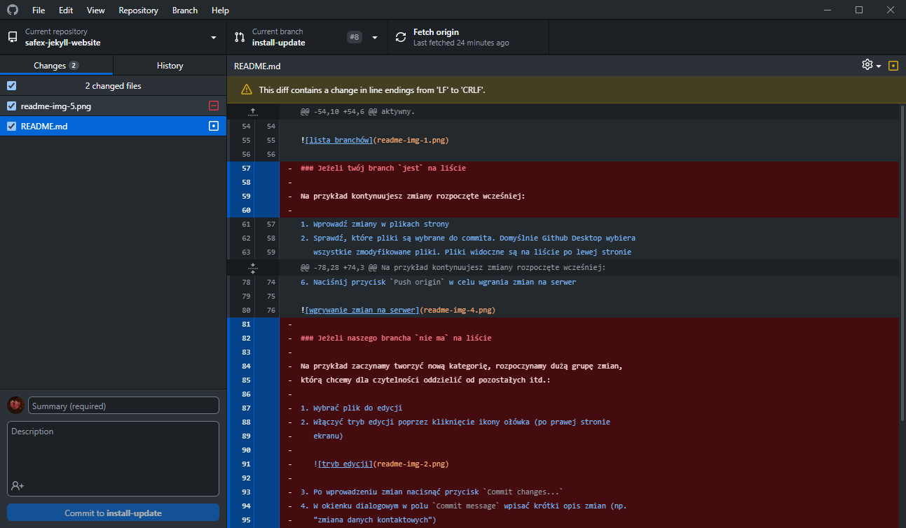

# Safex — strona wizytówka

## Szybka ściąga

<!-- prettier-ignore -->
> [!IMPORTANT]
> W nazwach plików źródłowych nie stosuj spacji i polskich znaków — zamiast
> nazwy `nasze usługi.md` wybierz raczej `nasze-uslugi.md`. Rozszerzenia plików
> (w tym zdjęć) również powinny być zapisywane małymi literami.

- Klonowanie repozytorium:
  ```
  git clone --recurse-submodule https://github.com/morphy/safex-jekyll-website.git
  ```
- Skrypt instalacyjny (wymagany po sklonowaniu):
  ```
  npm install
  ```
- Uruchomienie lokalnego podglądu:
  ```
  npm run dev
  ```
- Uruchomienie automatycznego formatowania:
  ```
  npm run format
  ```

<!-- prettier-ignore -->
> [!WARNING]
> Poniższa komenda twardo nadpisuje pliki. Jeśli ściagasz zmiany, które ktoś
> inny wprowadził na twóch branch, upewnij się że w międzyczasie nie dokonywałeś
> żadnych zmian, a jeśli tak - zapisz je w bezpiecznym miejscu.

- Reset brnacha do wersji zdalnej:
  ```
  git reset origin/NEPO-content-3 --hard
  ```

## Instalacja i uruchomienie lokalnej kopii

Lokalne środowisko umożliwia natychmiastowy podgląd wprowadzonych zmian.
Instrukcja instalacji:

1. Zainstaluj następujące narzędzia:

   - Git ([https://git-scm.com/downloads](https://git-scm.com/downloads))
   - Node.js ([https://nodejs.org/](https://nodejs.org/))
   - Ruby
     ([https://www.ruby-lang.org/en/documentation/installation/](https://www.ruby-lang.org/en/documentation/installation/))
   - Jekyll oraz Bundler (`gem install jekyll bundler`)

2. Uruchom okno PowerShell w folderze, do którego chcesz sklonować projekt
   (shift + prawy przycisk myszy).
3. Sklonuj repozytorium za pomocą polecenia
   `git clone --recurse-submodule https://github.com/morphy/safex-jekyll-website.git`.
   W katalogu pojawi się folder z projektem.
4. Przejdź do katalogu projektu przy użyciu polecenia `cd safex-jekyll-website`.
5. Uruchom skrypt instalacyjny za pomocą polecenia `npm install`.

Po zainstalowaniu projektu można używać następujących poleceń:

- `npm run dev` - uruchamia lokalny podgląd (dostępny pod adresem
  [http://localhost:4000](http://localhost:4000)).
- `npm run format` - uruchamia narzędzie do automatycznego formatowania plików.

Polecenia wywołuj w oknie PowerShell w **głównym katalogu projektu** (shift +
prawy przycisk myszy).

## Modyfikacja i dodawanie zawartości

<!-- prettier-ignore -->
> [!TIP]
> Utwórz tyle commitów, ile potrzebujesz. Zmiany warto organizować w mniejsze
> grupy za pomocą commitów, tak aby potem łatwo było zorientować się, co zostało
> kiedy dodane.

1. Edycję strony za każdym razem zacznij od sprawdzenia, czy odpowiedni branch
   jest aktywny.

   

2. Wprowadź zmiany w plikach strony.
3. Sprawdź, które pliki są wybrane do commita. Domyślnie Github Desktop wybiera
   wszystkie zmodyfikowane pliki. Pliki widoczne są na liście po lewej stronie
   okna. W prawej części ekranu widoczny jest tak zwany _diff_ — widok dokładnie
   pokazujący zmiany wprowadzone w plikach.

   

4. W lewym dolnym roku okna, w polu `Summary (required)` wpisz krótki opis zmian
   (np. "zmiana danych kontaktowych").
5. Naciśnij przycisk `Commit to [nazwa-brancha]`.

   

6. Naciśnij przycisk `Push origin` w celu wgrania zmian na serwer.

   
